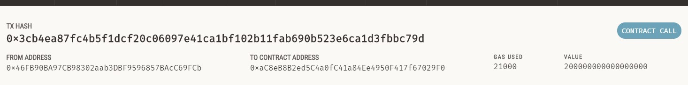

# BlockChain-Wallets:
1. In this activity the aim was to make a platform that will have the ability to facilitate client to hire a fintech candidate and make a selection on the basis of a few attributes that are privided by the app.
2. In order to do that following steps were performed:
  1. A python file was made named 'crypto_wallet' containing functions that would automate a few steps in the main streamlit python file, such as account generation, getting balance and sending transaction.
  2. A second streamlit python file named 'send_transaction' this would have all the code through which the app would run on the stramlit platform
  3. The lay out of the app was such that it enabled the client to choose from a list of fintech professionals depending on their per hour charges in eth. The client could also use a feature of the help to calculate the total amount he would be charged for the time he would be hiring the professional for. A visual representation of the app is shown below:
  
  4. After selecting the individual and calculating the charges the client would be able to send the transaction.Following is an example of the transaction and its confirmation:
  
  